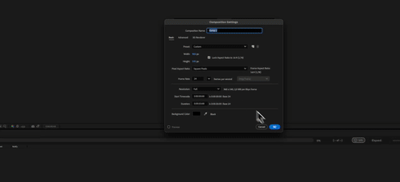

# AE Sprite Sheet Exporter

Adobe After Effects CEP extension for exporting compositions as optimized sprite sheets with JSON metadata. Built with modern ES6+ JavaScript and Vite for optimal performance and compatibility.

## ✨ Features

- **🎨 Canvas-Based Processing**: Pure JavaScript sprite sheet generation (no external dependencies)
- **🚀 Modern UI**: Beautiful interface with loading states and copy-to-clipboard functionality
- **📁 Organized Output**: Creates dedicated folders for each export with clean file structure
- **⚡ Fast & Reliable**: Simplified PNG-only workflow for maximum compatibility
- **🔧 Modern Build System**: Built with Vite, using ES6+ syntax transpiled to ES3/5 for CEP compatibility
- **📊 Smart Layout**: Automatically calculates optimal sprite sheet layouts
- **📄 Comprehensive Metadata**: Generates detailed JSON with frame data and animation info

## 🎬 Demo

See the AE Sprite Sheet Exporter in action:



*Watch the complete workflow: opening the extension in After Effects, loading a composition, and exporting a sprite sheet with metadata.*

> **🎥 Full Quality Video**: [`ae_export_sprite_demo.mp4`](./demo/ae_export_sprite_demo.mp4) *(Click to download the full MP4 version)*

### What you'll see in the demo:
1. **🔧 Extension Installation** - Quick setup process
2. **🎨 After Effects Integration** - Seamless workflow within AE
3. **📊 Real-time Processing** - Live progress updates and feedback
4. **📁 Organized Output** - Clean file structure with sprite sheet and JSON metadata
5. **🚀 Modern UI** - Beautiful interface with loading states and copy functionality

## 🚀 Quick Start

### Installation

1. **Clone and install dependencies:**
   ```bash
   git clone git@github.com:leonidkuznetsov18/ae-sprite-sheet-exporter.git
   cd ae-sprite-sheet-exporter
   npm install
   ```

2. **Build and install the extension:**
   ```bash
   npm run install:extension
   ```

3. **Open After Effects** and find "Sprite Sheet Exporter" in the Window > Extensions menu

### Build/Dev process

- **Build extension:** `npm run build` (builds all files to dist)
- **Install extension:** `npm run install:extension` (builds and symlinks to CEP extensions folder)

## 🏗️ Build System

This project uses a modern, optimized build system with Vite that creates production-ready, self-contained extension packages:

### Project Structure
```
├── index.html       # Main UI (builds to dist/index.html)
├── src/
│   └── main.js      # Modern ES6+ code with bundled dependencies
├── public/          # Static files (copied to dist/)
│   ├── CSInterface.js # Adobe CEP interface
│   ├── .debug       # CEP debug configuration
│   ├── CSXS/        # CEP manifest
│   └── host/        # ExtendScript for After Effects
└── vite.config.js   # Optimized Vite configuration
```

### Build Process

1. **ES Module Bundling**: Bundles all Node.js dependencies (fs-extra, etc.) into a single 39KB file
2. **Legacy Support**: Generates both modern and legacy bundles for CEP compatibility
3. **Static Copy**: Automatically copies all `public/` files to `dist/`
4. **Self-Contained Output**: Creates a complete extension package in `dist/`

### Output Structure (Self-Contained)
```
dist/                # Complete, distributable extension package
├── index.html       # Main UI with injected scripts
├── assets/
│   ├── index.js     # 39KB bundled file (includes fs-extra)
│   └── index-legacy.js # Legacy browser support
├── CSInterface.js   # CEP interface
├── .debug           # Debug configuration
├── CSXS/            # CEP manifest
└── host/            # ExtendScript files
```

## 📖 Usage

1. **Open After Effects** and create or open a composition
2. **Launch the extension** from Window > Extensions > Sprite Sheet Exporter
3. **Click "🔄 Update Composition Info"** to load your active composition
4. **Click "📦 Export Sprite Sheet"** to select output folder and generate files

### 📁 Output Structure

Each export creates a dedicated folder with the following structure:
```
[CompName]_spritesheet_[YYYY-MM-DD]/
├── 🖼️ spritesheet.png    # Main sprite sheet image
└── 📄 metadata.json      # Frame coordinates and animation data
```

## 🔧 Technical Details

### Core Technologies

- **Canvas API**: High-performance sprite sheet generation in pure JavaScript
- **fs-extra**: Enhanced file system operations (bundled into single file)
- **Vite**: Modern build tool with optimized bundling and legacy support
- **@vitejs/plugin-legacy**: Ensures compatibility with older CEP environments

### PNG Processing Workflow

1. **Template Detection**: Automatically finds After Effects PNG sequence templates
2. **Render Queue**: Uses AE's built-in render queue for frame export
3. **Canvas Processing**: Loads PNG frames and composites into sprite sheet
4. **Smart Layout**: Calculates optimal grid arrangement for frames
5. **Metadata Generation**: Creates comprehensive JSON with frame coordinates

### Compatibility

- **After Effects**: 2022 and later (CEP 12.0+)
- **Node.js**: 17.7.1+ (embedded in After Effects)
- **Platforms**: macOS and Windows
- **Input Formats**: PNG sequences from After Effects render queue

## 💻 Development Notes

### CEP Compatibility

The build system ensures compatibility by:
- **Optimized bundling** with all dependencies included in a single file
- **Legacy support** for older CEP environments (Chrome 58+)
- **Node.js module handling** with proper externalization of CEP built-ins
- **Self-contained package** - no external dependencies required at runtime

### Debugging

Debug mode is automatically enabled during installation. Use the "📋 Copy Logs" button to easily share debug output for troubleshooting.

## 🛠️ Troubleshooting

### Common Issues

**Extension Not Appearing:**
1. Verify debug mode is enabled
2. Check CEP extensions folder for symlink
3. Restart After Effects
4. Check Console for CEP errors

**Export Fails:**
1. Ensure composition is selected and active
2. Check debug output for specific error messages
3. Verify PNG template availability in After Effects
4. Try with a simpler composition first

**Build Issues:**
- Ensure all dependencies are installed: `npm install`
- Clear dist and rebuild: `rm -rf dist && npm run build`
- Check Node.js version: `node --version` (should be 17.7.1+)

## 📊 Performance

- **Bundle Size**: 39KB modern + 40KB legacy (includes all dependencies)
- **Processing**: Canvas-based, no external image libraries
- **Memory**: Efficient frame-by-frame processing
- **Speed**: Direct PNG processing without format conversion
- **Distribution**: Single self-contained folder (~150KB total)

## 📦 Distribution

The build system creates a completely self-contained extension package:

### For Development
```bash
npm run install:extension  # Symlinks dist/ to CEP extensions folder
```

### For Distribution
```bash
npm run build              # Creates complete package in dist/
```

The `dist/` folder contains everything needed:
- ✅ **No node_modules** - all dependencies bundled
- ✅ **No build tools** - ready to run
- ✅ **Cross-platform** - works on macOS and Windows
- ✅ **Adobe Store ready** - just zip the dist/ folder

Users can install by copying the `dist/` folder to their CEP extensions directory.

## 📄 License

MIT License - see LICENSE file for details.

## 🤝 Contributing

1. Fork the repository
2. Create a feature branch
3. Make changes using modern ES6+ syntax
4. Test with `npm run install:extension`
5. Submit a pull request

---

**Built with ❤️ using modern JavaScript, Canvas API, and Vite by Leonid Kuznetsov** 